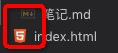

## 安装浏览器

真正具有自己独立内核的浏览器有哪些：

```text                 
    浏览器名称                     内核
    Chrome                      Webkit(和苹果公司合约问题)/ Blink 
    FireFox                     Gecko
    Safari                      Webkit
    Opera                       Presto(废弃) / Blink(目前)
    IE                          Trident  
```
其它浏览器： 无自己的内核，内核是用的别人的，只是把外壳（菜单，UI）换了下

```text
    360浏览器
    搜狗浏览器
    。。。
```

扩展知识：

```text
    浏览器的内核主要包括三个技术分支：排版渲染引擎，JavaScript引擎，以及其它
    排版渲染引擎：负责取得网页的内容（HTML，XML，图像等），整理信息，以及计算机的显示方式，然后输出到显示器中，决定了浏览器如何显示内容以及页面的格式信息
    JavaScript引擎：是用来渲染JavaScript的，渲染越快，页面的动态效果越快

```

推荐：
```text

    Chorme 谷歌浏览器
    官网：https://www.google.cn/intl/zh-CN/chrome/
```


## 开发工具

```text
    VsCode 编辑器
    官网：https://code.visualstudio.com/
```

### VsCode常用插件

#### vscode-icons

VScode文件的图标样式



windows系统：vscode-icons
mac系统:    vscode-icons-mac

#### Live Server

热更新插件，边写边保存，浏览器热更新出效果


#### Markdown  Preview Enhanced

增强预览效果


MarkDown基础语法

```text
    #       一级标题
    ##      二级
    ###     三级
    ####    四级
    ...

    ```js
        内容是js语法
    ```

    ```xml
        内容是xml格式的
    ```

    图片的增加：Mac下 要用Paste Image插件

```

####  Paste Image
Mac 电脑需要安装此插件，才能在Markdown里插入图片
快捷键：Command + Alt + V (先复制图片/或者截图)

