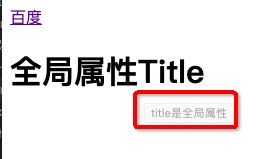

## 注释

格式如下

```html
    <!-- Content -->
```

## 元素/标签/标记

>不同的书籍叫法不太一样 但是都指的相同的东西

```html
    比如：a标签, title标签
    <a href="http://www.baidu.com">百度</a>
    <title>Document</title>
```
整体：element 元素
元素 = 起始标记 + 结束标记 + 元素内容 + 元素属性
属性 = 属性名 + 属性值   href: 属性名， "http://www.baidu.com" ：属性值

属性的分类：
- 局部属性：当前元素特有的属性
- 全局属性：全部标签都可用（
```html
    比如：
    <a href="http://www.baidu.com">百度</a>
    href: 局部属性，a元素特有
    <h1 title='全局属性title'>全局属性title</h1>
    title: 全局属性，h1标签也可用
```


### 空元素

有些元素没有结束标记，也就没有元素内容，这种元素叫: **空元素**

```html
    html5版本：
    
    <meta charset="UTF-8">
    <input type="text">
```

以前的版本可用写成如下：

```html
    
    <meta charset="UTF-8"/>
    <input type="text"/>
```

### 父元素 子元素 祖先元素 后代元素 兄弟元素

```html
    <html>
        <body>
            <div></div>
            <p></p>
        </body>
    </html>
```
### 标准的文档结构

HTML：页面结构，HTML文档结构，W3C定义的文档标准，不能乱写

```html
    <!DOCTYPE html> <!-- 文档声明：告诉当前浏览器，当前文档使用的标准是HTML5,不写会导致浏览器进入怪异渲染模式，不写浏览器会自动选择一个标准执行，有些元素会加载问题 -->
    <html lang="en"> <!-- 根元素：只能有一个,html5不要求必需，但是XHTML要满足开闭原则，必需 -->
    <head> <!-- 文档头，不会显示的，就像人的大脑，人的大脑的想法肯定是看不到的-->
        <meta charset="UTF-8"> <!-- 告诉浏览器 文档内容采用的是什么 字符编码格式, 浏览器会按照 字符编码格式进行解析 -->
        <meta name="viewport" content="width=device-width, initial-scale=1.0"><!-- 主要适用于手机端，网页的适口的宽度设置成设备宽度 适配手机端 后期讲手机会有详细介绍 -->
        <meta http-equiv="X-UA-Compatible" content="ie=edge"><!-- 解决IE问题，IE的市场由90%到现在的不足3% IE浏览器内核有很多问题 这些问题已经不好解决了 微软那边已经焦头烂额了，所以在Win10版本出来之后，做了一个新的浏览器 叫做Edge 这句话的意思就是：告诉浏览器 如果是IE浏览器的话 最好使用Edge内核 -->
        <title>Document</title><!-- 网站标题 -->
    </head>
    <body><!-- 文档体，要显示元素，都放在文档体里-->
        
    </body>
    </html>
```

### 扩展 字符编码（UTF-8，GB2312, GBK 等）

首先要理解计算机工作原理，像我们写了很多的字母(a, b, c ...)，符号(#,%, & ), 文字(张三李四...) 这些东西，计算是识别不了的，

计算机中，有两个电压波段 
低压电（0-2v）电子元件 用 0 表示
高压电（2-5V）电子元件 用 1 表示

那么在计算机中 只能存储数字，以二进制表示

比如： a -> 97  A -> 64
通过这种方式，把每一个文字，字母 和 数字的形式对应，这种对应的关系就像一本字典

**那么有字典就涉及到一个问题，世界上这么多国家，每个国家都有自己的文字，如果每个国家都造一本这个字典，那么字典是不是就一样了**

中国目前使用的编码表：GB2312 中文汉字编码表
台湾： GBK  中文繁体编码表
```text
    如果一个汉字：比如 ‘龙’ 
    在GB2312 对应的 数字是 9999， 
    在GBK  数字 9999 对应的 ‘&@’
```
那么读的时候如果用GBK 那么就会出现乱码 编码不一样了

> **UTF-8** 
这里用的是UTF-8，是Unicode编码的一个版本
Unicode 编码是万国码，是把全世界所有的字符编码 弄成一个打的字典


