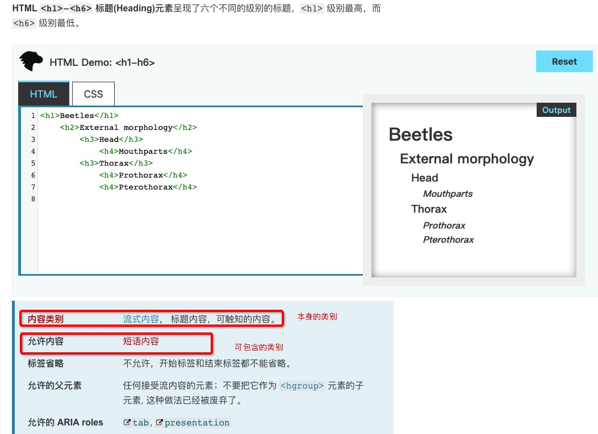

## html5以前的包含关系 

块级元素可以包含行级元素，行级元素不能包含块级元素，a元素除外

## html5现在的包含关系

元素的包含关系由元素内容类别决定, 这种定义就是为了html5的语义而设定的

例如：h1元素内部能不能包含p元素???

语义上理解，这种包含关系是不成立的

实际可以通过MDN网站的标准进行查询

再看允许内容中的 短语内容 有哪些
这样就能看到 h1元素内容 可以包含哪些内容，发现没有p元素

通过上面的方式 可以查看元素在html5中的包含关系

## 总结

1. 容器元素中可以包含任何元素
2. a元素中几乎可以包含任何元素
3. 某些元素有固定的子元素(ul > li, ol > li, dl > dt + dd)
4. 标题元素和段落元素不能相互嵌套，并且不能包含容器元素

内容类别链接：https://developer.mozilla.org/zh-CN/docs/Web/Guide/HTML/Content_categories

