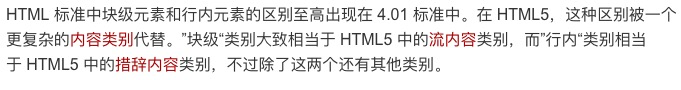
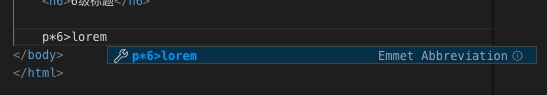

## HTML5中支持那些元素呢

HTML5元素周期表
官网：http://www.xuanfengge.com/funny/html5/element/

## h元素  [head]

h1 ~ h6: 表示1级标题～ 6级标题

```html
    <h1>1级标题</h1>
    <h2>2级标题</h2>
    <h3>3级标题</h3>
    <h4>4级标题</h4>
    <h5>5级标题</h5>
    <h6>6级标题</h6>
```

## p元素 [paragraphs]

```html
    <p>Lorem ipsum dolor, sit amet consectetur adipisicing elit. Ipsam voluptatibus iste corporis natus numquam harum blanditiis possimus ut magnam dolores vero voluptates, deserunt assumenda earum animi, porro sint ea? Dolores?</p>
    <p>Perferendis aspernatur qui dolor eius, ipsa officiis dignissimos quae! Fuga ipsum, odit harum iure sunt unde. Quis illo maxime sed sunt consectetur. Iure veniam odio eius accusantium ad cupiditate consequuntur!</p>
    <p>Distinctio beatae in placeat officia at explicabo? Laboriosam iure quisquam facere doloribus veniam dignissimos fuga modi expedita voluptas atque pariatur perferendis libero quidem, consequatur adipisci eos laudantium saepe temporibus fugiat.</p>
    <p>Doloremque eos sit debitis ex ipsam quaerat mollitia tempora nulla illo exercitationem cupiditate nihil, voluptas, veniam, consectetur voluptatum asperiores fugiat rerum at aspernatur sed harum. Voluptas totam quia odit! Tempore.</p>
    <p>Ducimus delectus distinctio praesentium sapiente, sed optio debitis unde doloribus cumque numquam aliquid repellendus perspiciatis non a accusantium animi dignissimos tempore quisquam ea repellat iusto? Eaque adipisci nulla aperiam illo.</p>
    <p>Exercitationem qui doloribus non aut, nihil adipisci quibusdam repudiandae excepturi eos a repellendus porro quos libero pariatur quisquam omnis repellat! Corporis est dignissimos, odio vero nulla voluptate placeat harum sed!</p>
```

## span [无语义的元素]

html5抛弃了很多 无语义的元素，但是保留了span这个元素

没有语义，仅用于设置样式

```html
    三原色：<span style="color: red">红</span>
    <span style="color: green">绿</span>
    <span style="color: blue">蓝</span>
```

## span 扩展的块级元素，行内元素

### 以前的叫法（HTML5以前

某些元素在显示时会独占一行（块级元素）
某些元素不会独占一行（行级元素/行内元素）

### 现在，到了HTML5，已经弃用上面的叫法



相关知识更多链接：https://developer.mozilla.org/zh-CN/docs/Web/HTML/Block-level_elements

## pre 

预格式化文本元素

> 空白折叠：在源代码中的连续空白字符（空格，换行，制表(tab), 在页面中显示，会被折叠成一个空格）

在 pre 这个元素中的内容，不会出现空白折叠

**作用：通常用于在网页中显示代码**

## 扩展知识

### 乱数假文

当做前端时, 需要一些假数据的时候, 可以使用乱数假文来杜绝内容对UI的影响

VSCODE的Emmet插件，如下书写，可以生产不同段落的乱数假文

上面的图片按下 Tab


更多知识链接：https://baike.baidu.com/item/Lorem%20ipsum/3684081?fr=aladdin