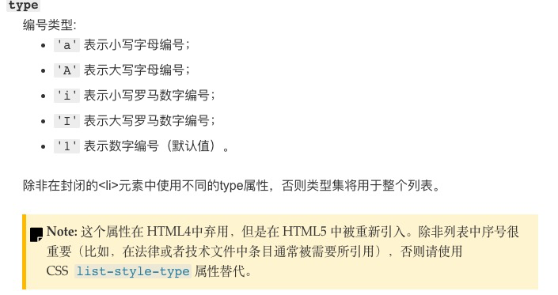
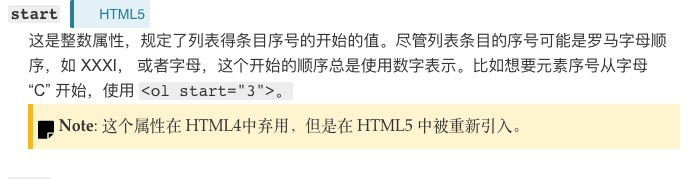

## 有序列表

网页上用的不多

ol: ordered list 有序列
li: list item 列表项

```html
把大象装冰箱，总共分几步
<ol type="">
    <li>打开冰箱门</li>
    <li>大象放进去</li>
    <li>冰箱门关上</li>
</ol>
```

### type 属性

- 1 按数字排列 1，2，3，4，5，6
- i 按罗马数字 i ii iii 
- I 按大写罗马数字 I, II, III
- a 按小写字母排列 a, b, c, d 
- A 按大写字母排列 A, B, C, D

对于A，a 当超过26 英文字母的时候 怎么表示呢：aa, ab ...  AA, AB 



### start 属性



### reversed 属性

倒着排序

## 无序列表

网页上用的比较多

ul: unordered list 无序列
li: list item 列表项

**常用于制作菜单/新闻列表**

```html
<!-- 无序列表 -->
美女择偶标准
<ul>
    <li>有责任心</li>
    <li>会家务</li>
    <li>漂亮</li>
</ul>
```

## 定义列表

通常用于一些术语的定义
通常用于一些文献里，用的也不多

dl: definition list 定义列
dt: definition title 定义列标题
dd: definition description 定义列描述

```html
<!-- 定义列表 -->
HTML中的术语解释
<dl>
    <dt>
        HTML
    </dt>
    <dd>
        超文本标记语言
    </dd>
    <dt>
        CSS
    </dt>
    <dd>
        层叠样式表
    </dd>
</dl>
```

