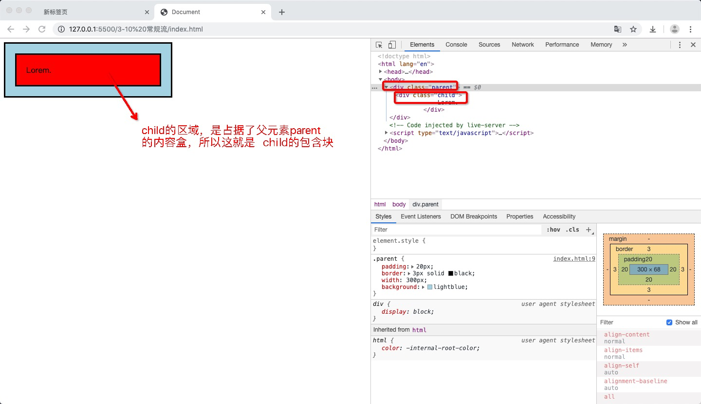
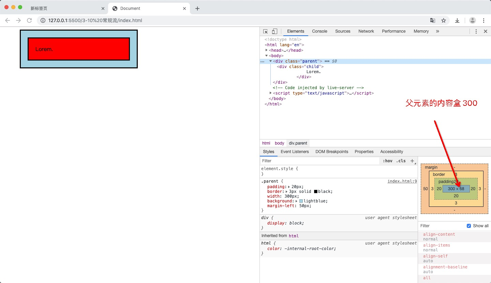
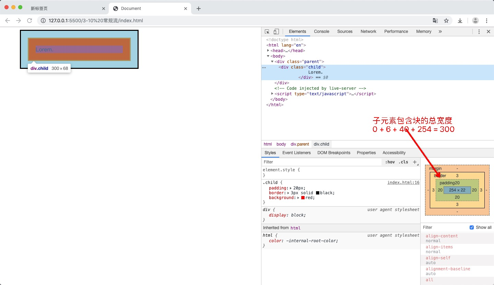
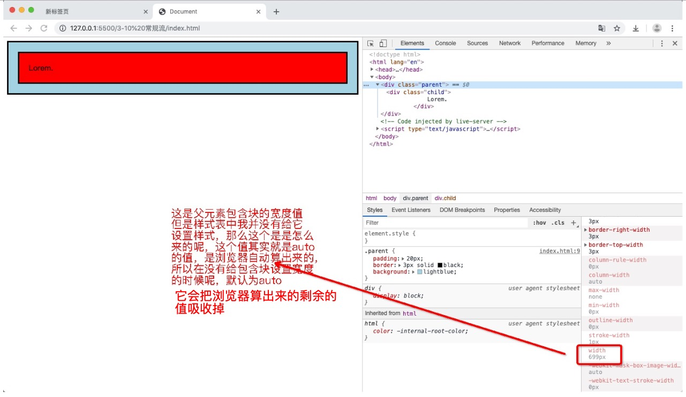
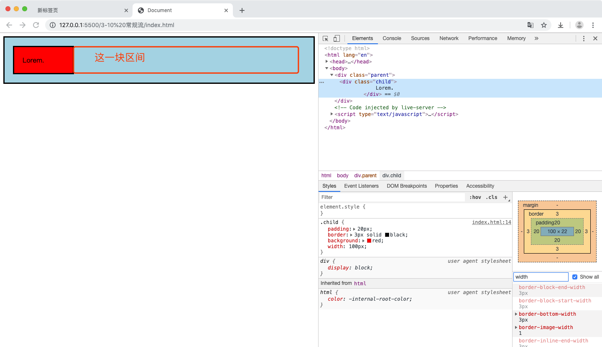
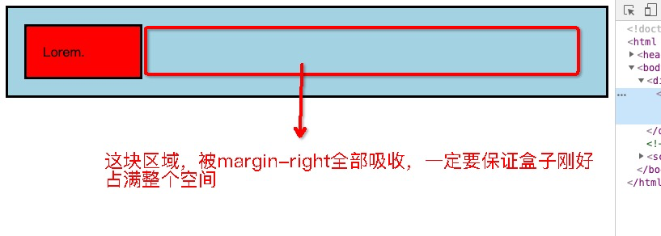
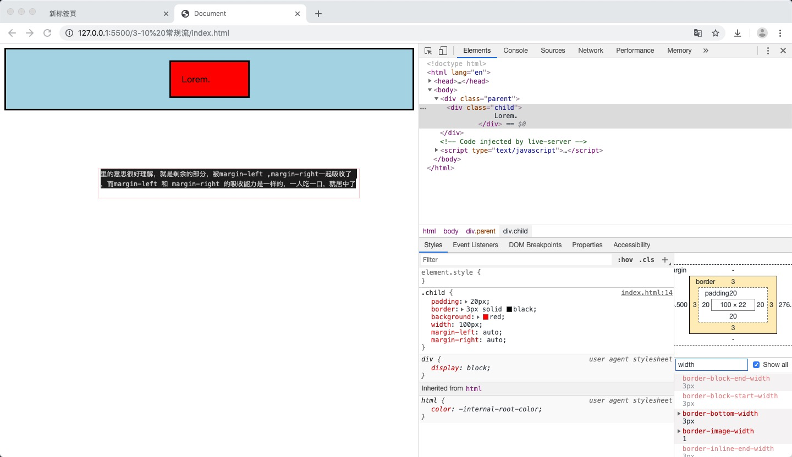
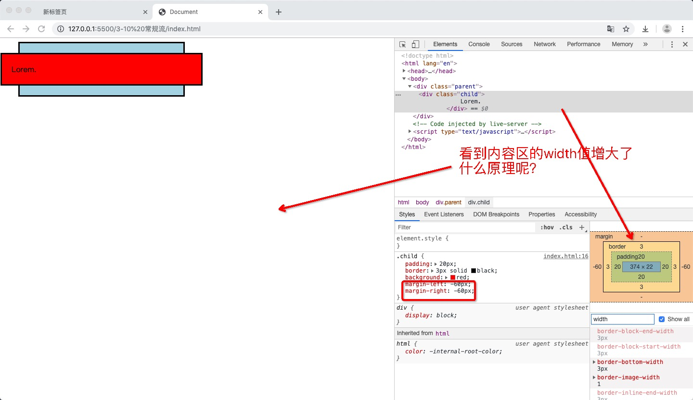
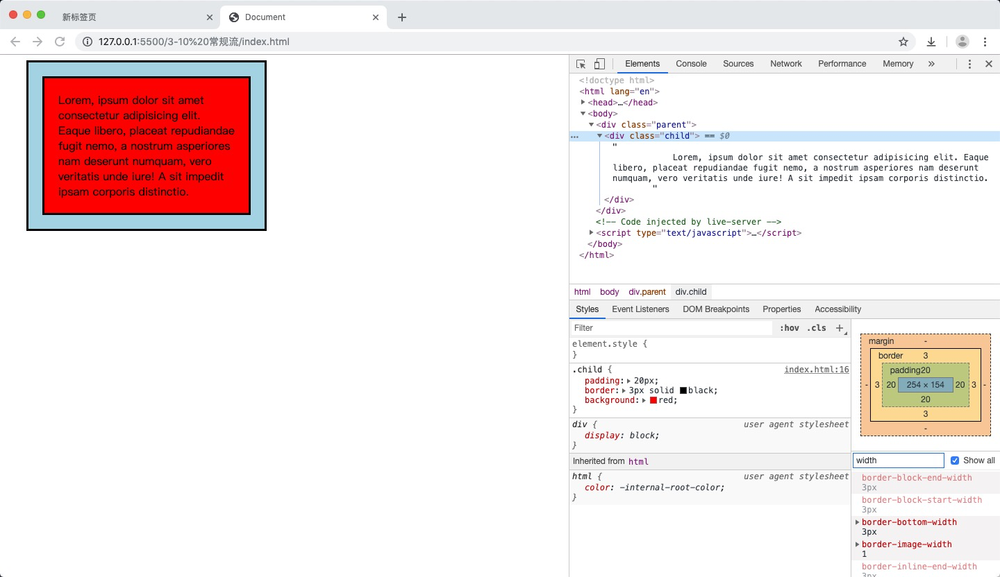
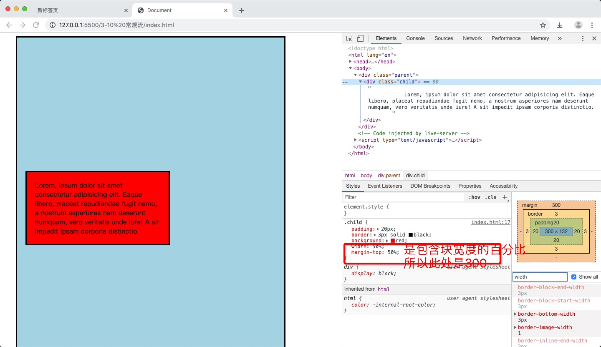

## 前言

视觉格式化模型

之前学习过盒模型，盒模型指的是规定单个盒子的规则（一个盒子由哪些组成，行盒是什么样的，块盒是什么样的）

但是我们页面上有这么多元素，每个元素都要生成一个盒子，每个盒子是怎么排列的，行盒是怎么排列的，块盒是什么排列的，这就是视觉格式化模型。

视觉格式化模型：页面中的多个盒子的排列规则，我们有时候也称布局规则。

视觉格式化模型，大体上将页面中盒子的排列分为三种方式：

1. 常规流
2. 浮动
3. 定位

## 常规流布局

常规流又有几种说法，文档流，普通文档流，常规文档流。

**所有元素，默认情况下，都属于常规流布局**

### 布局总体规则

块盒独占一行，行盒水平方向一次排列

### 包含块 (containing block)

概念：每个盒子都有它的包含块，包含块决定了盒子的排列区域，在页面上的位置。

（把包含块理解成网页上的一个坐标系，每个盒子都有它的包含块，也就是每个盒子都有它的一个坐标系，这个坐标系是根据包含块决定的，也就是包含块在在哪里，这个盒子就在哪里）

绝大部分情况下：盒子的包含块，为其父元素的内容盒

```html
<!DOCTYPE html>
<html lang="en">
<head>
    <meta charset="UTF-8">
    <meta name="viewport" content="width=device-width, initial-scale=1.0">
    <meta http-equiv="X-UA-Compatible" content="ie=edge">
    <title>Document</title>
    <style>
        .parent {
            padding: 20px;
            border: 3px solid black;
            width: 300px;
            background: lightblue;
        }
        .child {
            padding: 20px;
            border: 3px solid black;
            background: red;
        }
    </style>
</head>
<body>
    <div class="parent">
        <div class="child">
            Lorem.
        </div>
    </div>
</body>
</html>
```


现在我们给父元素设置一个margin-left属性
```css
.parent {
    padding: 20px;
    border: 3px solid black;
    width: 300px;
    background: lightblue;
    /* 新增属性 */
    margin-left: 50px;
}
```

### 常规流布局哪些规则

#### 块盒的宽度

每个块盒的总宽度（margin + border + padding + 内容区），必须刚好等于包含块的宽度

```html
<!DOCTYPE html>
<html lang="en">
<head>
    <meta charset="UTF-8">
    <meta name="viewport" content="width=device-width, initial-scale=1.0">
    <meta http-equiv="X-UA-Compatible" content="ie=edge">
    <title>Document</title>
    <style>
        .parent {
            padding: 20px;
            border: 3px solid black;
            width: 300px;
            background: lightblue;
            margin-left: 50px;
        }
        .child {
            padding: 20px;
            border: 3px solid black;
            background: red;
        }
    </style>
</head>
<body>
    <div class="parent">
        <div class="child">
            Lorem.
        </div>
    </div>
</body>
</html>
```

父元素的内容盒宽度



子元素的包含块的总宽度



##### 1. 宽度的值 （默认auto）

如果我将父元素的width属性去掉，那么我们再来看这个例子，其实就会发现，
父元素的包含块其实就是body的内容喝

```html
<!DOCTYPE html>
<html lang="en">
<head>
    <meta charset="UTF-8">
    <meta name="viewport" content="width=device-width, initial-scale=1.0">
    <meta http-equiv="X-UA-Compatible" content="ie=edge">
    <title>Document</title>
    <style>
        .parent {
            padding: 20px;
            border: 3px solid black;
            background: lightblue;
        }
        .child {
            padding: 20px;
            border: 3px solid black;
            background: red;
        }
    </style>
</head>
<body>
    <div class="parent">
        <div class="child">
            Lorem.
        </div>
    </div>
</body>
</html>
```


如上所示：在我没有给包含块设置width 宽度的时候， 包含块的默认值是：auto

这里的auto（仅针对于此种情景，因为auto有很多的表达方式），在这里的auto表示：将剩余空间吸收掉



##### 2. margin的取值，（默认是0）

margin的取值 也可以是auto，意思也是一样的，把剩余空间吸收掉，只不过margin一般默认为0

##### 3. width 和 margrin 都为auto的情况

如下面的例子, 我给子元素都设置了width: auto , margin: auto

根据上面讲到的，width 设置为auto的时候，是将剩余空间吸收带哦
margin设置auto的时候，也是将剩余空间吸收掉，两个属性都在抢这个剩余空间
吸收，谁厉害的？

width的吸收能力，强于margin的吸收能力

```html
<!DOCTYPE html>
<html lang="en">
<head>
    <meta charset="UTF-8">
    <meta name="viewport" content="width=device-width, initial-scale=1.0">
    <meta http-equiv="X-UA-Compatible" content="ie=edge">
    <title>Document</title>
    <style>
        .parent {
            padding: 20px;
            border: 3px solid black;
            background: lightblue;
        }
        .child {
            padding: 20px;
            border: 3px solid black;
            background: red;
            width: auto;
            margin: auto;
        }
    </style>
</head>
<body>
    <div class="parent">
        <div class="child">
            Lorem.
        </div>
    </div>
</body>
</html>
```


##### 4. width 固定值 的情况

现在给width 设置固定值，margin不设置。

```html
<!DOCTYPE html>
<html lang="en">
<head>
    <meta charset="UTF-8">
    <meta name="viewport" content="width=device-width, initial-scale=1.0">
    <meta http-equiv="X-UA-Compatible" content="ie=edge">
    <title>Document</title>
    <style>
        .parent {
            padding: 20px;
            border: 3px solid black;
            background: lightblue;
        }
        .child {
            padding: 20px;
            border: 3px solid black;
            background: red;
            width: 100px;
        }
    </style>
</head>
<body>
    <div class="parent">
        <div class="child">
            Lorem.
        </div>
    </div>
</body>
</html>
```


当我宽度固定一个值之后，如上图所示，发现空白了一部分区间

这里问题来了，水平方向上 margin的值是多少？

刚才我们第2条说了, margin 没设置的时候，默认为0 

那么问题又来了，标题我们说了，包含块的总宽度 等于 margin + border + padding + 内容区域, 而这里显然 是不够的


**规定：若宽度，内边距，外边距计算后，仍然有剩余空间，该剩余空间被margin-right全部吸收**

> 为什么被margin-right吸收呢，因为这是跟我们网页文字布局相关的，文字布局是从左往右进行排列的

所以上面的问题就得到了合理的解释




##### 5. width 固定值 的情况， margin-left: auto, margin-right: auto

这种情况下会显示什么呢，发现盒子居中了。这里的意思很好理解，就是剩余的部分，被margin-left ,margin-right一起吸收了，而margin-left 和 margin-right 的吸收能力是一样的，一人吃一口，就居中了

```html
<!DOCTYPE html>
<html lang="en">
<head>
    <meta charset="UTF-8">
    <meta name="viewport" content="width=device-width, initial-scale=1.0">
    <meta http-equiv="X-UA-Compatible" content="ie=edge">
    <title>Document</title>
    <style>
        .parent {
            padding: 20px;
            border: 3px solid black;
            background: lightblue;
        }
        .child {
            padding: 20px;
            border: 3px solid black;
            background: red;
            width: 100px;
            margin-left: auto;
            margin-right: auto;
        }
    </style>
</head>
<body>
    <div class="parent">
        <div class="child">
            Lorem.
        </div>
    </div>
</body>
</html>
```



**在常规流中，块盒在其包含块重的居中方式，可以定宽，然后左右margin设置auto**

##### 6. width：auto, margin-left: -60px; margin-right: -60px;

我们先看一个 width： auto， margin-left: 0px; margin-right: 0px 的例子


设置：margin-left: -60px; margin-right: -60px; 宽度width不设置默认为auto

注意看width的变化



**由于margin设置了负数，导致剩余空间变多，因为宽度width又是auto，所以剩余空间被width吸收了，所以变长了，但是即使变长了，包含块的宽度也是等于父元素的内容盒的宽度的**

#### 块盒 垂直方向上的值

##### 1. height：auto，适应内容的高度

height为auto，其实不管是常规流，还是浮动，定位啊，表示的都是适应内容的高度，没有设置高度，就是auto，内容有多高，他就有多高

```html
<!DOCTYPE html>
<html lang="en">
<head>
    <meta charset="UTF-8">
    <meta name="viewport" content="width=device-width, initial-scale=1.0">
    <meta http-equiv="X-UA-Compatible" content="ie=edge">
    <title>Document</title>
    <style>
        .parent {
            padding: 20px;
            border: 3px solid black;
            background: lightblue;
            width: 300px;
            margin-left: 30px;
        }
        .child {
            padding: 20px;
            border: 3px solid black;
            background: red;
        }
    </style>
</head>
<body>
    <div class="parent">
        <div class="child">
            Lorem, ipsum dolor sit amet consectetur adipisicing elit. Eaque libero, placeat repudiandae fugit nemo, a nostrum asperiores nam deserunt numquam, vero veritatis unde iure! A sit impedit ipsam corporis distinctio.
        </div>
    </div>
</body>
</html>
```


可以看到子元素的高度被内容撑开了，子元素的高度变高了，子元素又把父元素撑开了，父元素变高了，但是父元素并没有设置高度height

##### 2. margin: auto 在垂直方向上

margin 在垂直方向是的auto 就是0

#### 百分比取值

padding, 宽，margin可以取之为百分比。

以上的所有的百分比相对的是 包含块的宽度

比方说：对子元素设置百分比
```css
.child {
    padding: 20px;
    border: 3px solid black;
    background: red;
    /* 设置百分比 */
    width: 50%;
    margin-left: 50%;
}
```
那么width 和 margin-left 的实际值是多少？

```html
<!DOCTYPE html>
<html lang="en">
<head>
    <meta charset="UTF-8">
    <meta name="viewport" content="width=device-width, initial-scale=1.0">
    <meta http-equiv="X-UA-Compatible" content="ie=edge">
    <title>Document</title>
    <style>
        .parent {
            padding: 20px;
            border: 3px solid black;
            background: lightblue;
            width: 600px;
            height: 1000px;
            margin-left: 30px;
        }
        .child {
            padding: 20px;
            border: 3px solid black;
            background: red;
            width: 50%;
            margin-left: 50%;
        }
    </style>
</head>
<body>
    <div class="parent">
        <div class="child">
            Lorem, ipsum dolor sit amet consectetur adipisicing elit. Eaque libero, placeat repudiandae fugit nemo, a nostrum asperiores nam deserunt numquam, vero veritatis unde iure! A sit impedit ipsam corporis distinctio.
        </div>
    </div>
</body>
</html>
```


问题来了： 我设置margin-top为50% 那么margin-top是多少
```css
.child {
    padding: 20px;
    border: 3px solid black;
    background: red;
    /* 设置百分比 */
    width: 50%;
    margin-top: 50%;
}
```



##### 高度的百分比：包含块的高度是否取决于子元素的高度，设置百分比无效

什么意思呢，就是我给子元素设置高度的百分比，但是父元素不设置高度

```css
/* 父元素 高度没设置 */
.parent {
    padding: 20px;
    border: 3px solid black;
    background: lightblue;
    width: 600px;
    margin-left: 30px;
}
.child {
    padding: 20px;
    border: 3px solid black;
    background: red;
    width: 50%;
    /* 子元素 高度 设置了百分比*/
    height: 50%;
}
```

根据一开始的定义，height不设置为auto，由内容决定高度，那么问题就来了，
父元素的高度没设置，高度要看子元素的内容，而子元素的高度又要看父元素的高度，如果是这种情况，那么设置百分比无效

##### 高度的百分比：包含块的高度不取决于子元素的高度

```css
.parent {
    padding: 20px;
    border: 3px solid black;
    background: lightblue;
    width: 600px;
    margin-left: 30px;
    /* 子元素 高度 设置了*/
    height： 50%;
}
.child {
    padding: 20px;
    border: 3px solid black;
    background: red;
    width: 50%;
    /* 子元素 高度 设置了百分比*/
    height: 50%;
}
```
子元素的百分比，就相对于父元素的高度


#### 上下外边距的合并

##### 两个常规流块盒，上下外边距相邻，会进行合并

两个外边距的值取最大值

```html
<!DOCTYPE html>
<html lang="en">
<head>
    <meta charset="UTF-8">
    <meta name="viewport" content="width=device-width, initial-scale=1.0">
    <meta http-equiv="X-UA-Compatible" content="ie=edge">
    <title>Document</title>
    <style>
        div{
            padding: 20px;
            border: 3px solid;
            margin: 50px;
        }    
    </style>
</head>
<body>
    <div>Lorem ipsum dolor sit amet consectetur adipisicing elit. Libero, facilis dicta maiores nam ratione eligendi obcaecati natus? Modi dicta molestias asperiores tempora? Totam assumenda adipisci veritatis eaque eum atque repellendus?</div>
    <div>Inventore corporis numquam recusandae veniam sit consequuntur vel illum harum culpa sed dolore, non repellat totam voluptatem sunt ut facilis doloribus earum ratione repudiandae, nostrum reiciendis voluptas dolor. Provident, nostrum.</div>
</body>
</html>
```


上面div的下边距 和 下面div的上边距 重合了

##### 父子元素之间外边距合并

```html
<!DOCTYPE html>
<html lang="en">
<head>
    <meta charset="UTF-8">
    <meta name="viewport" content="width=device-width, initial-scale=1.0">
    <meta http-equiv="X-UA-Compatible" content="ie=edge">
    <title>Document</title>
    <style>
        body{
            margin: 0;
        }
        .parent {
            background: lightblue;
            height: 300px;
            margin-top: 50px;
        }
        .child {
            height: 100px;
            background: red;
            margin-top: 50px;
            width: 200px;
        }
    </style>
</head>
<body>
    <div class="parent">
        <div class="child">
            Lorem, ipsum dolor sit
        </div>
    </div>
</body>
</html>
```


两个块盒元素外边距相邻了，所以合并了

##### 如何做到不合并呢

两个块盒元素外边距合并的前提是 相邻，

那么随便找个什么把他们隔开 就不会合并了 

比如：给父元素设置 border

```html
<!DOCTYPE html>
<html lang="en">
<head>
    <meta charset="UTF-8">
    <meta name="viewport" content="width=device-width, initial-scale=1.0">
    <meta http-equiv="X-UA-Compatible" content="ie=edge">
    <title>Document</title>
    <style>
        body{
            margin: 0;
        }
        .parent {
            background: lightblue;
            height: 300px;
            margin-top: 50px;
            /* 父元素设置border 消除外边距合并 */
            border: 2px solid;
        }
        .child {
            height: 100px;
            background: red;
            margin-top: 50px;
            width: 200px;
        }
    </style>
</head>
<body>
    <div class="parent">
        <div class="child">
            Lorem, ipsum dolor sit
        </div>
    </div>
</body>
</html>
```


那么有些人就矫情了，我不想用border 可以嘛，设计稿里没有那个border那条线

转换一下思路，不相邻即可，把子元素的margin，转换成父元素的padding就可以了

```html
<!DOCTYPE html>
<html lang="en">
<head>
    <meta charset="UTF-8">
    <meta name="viewport" content="width=device-width, initial-scale=1.0">
    <meta http-equiv="X-UA-Compatible" content="ie=edge">
    <title>Document</title>
    <style>
        body{
            margin: 0;
        }
        .parent {
            background: lightblue;
            height: 300px;
            margin-top: 50px;
            padding-top: 50px;
        }
        .child {
            height: 100px;
            background: red;
            /* margin-top: 50px; */
            width: 200px;
        }
    </style>
</head>
<body>
    <div class="parent">
        <div class="child">
            Lorem, ipsum dolor sit
        </div>
    </div>
</body>
</html>
```


