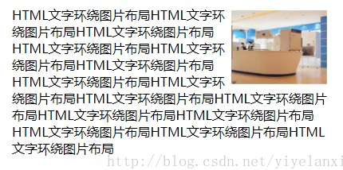
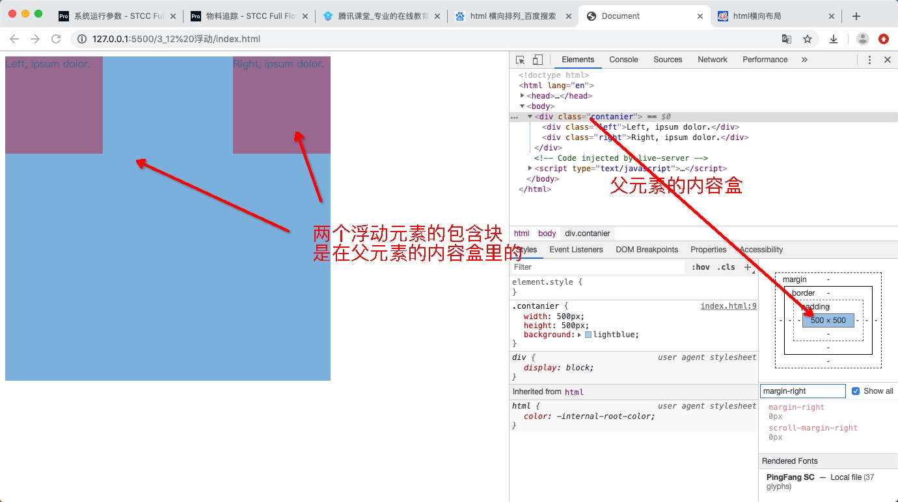
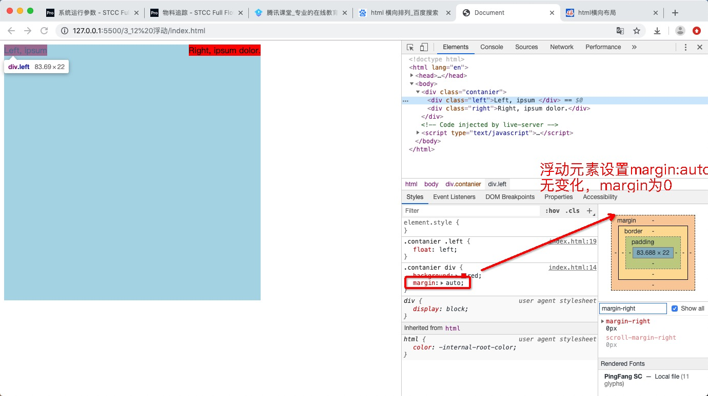
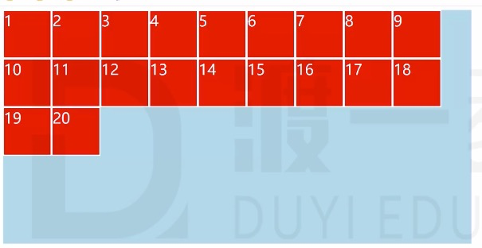
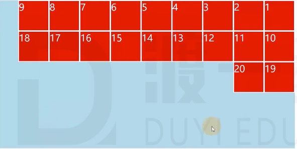
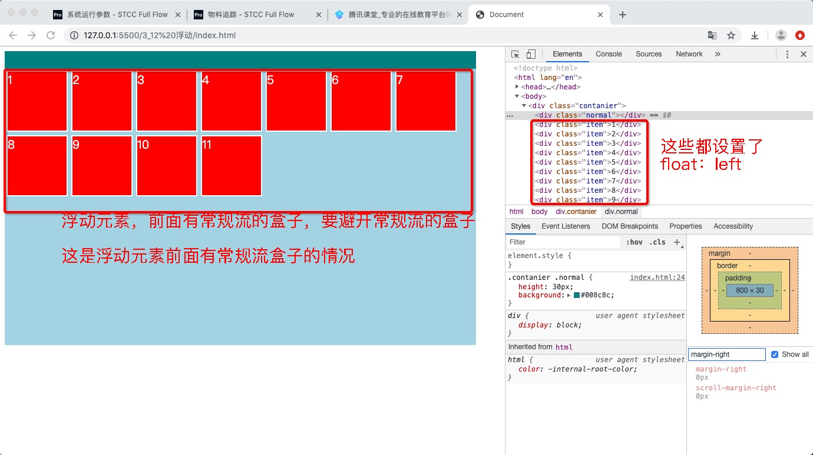
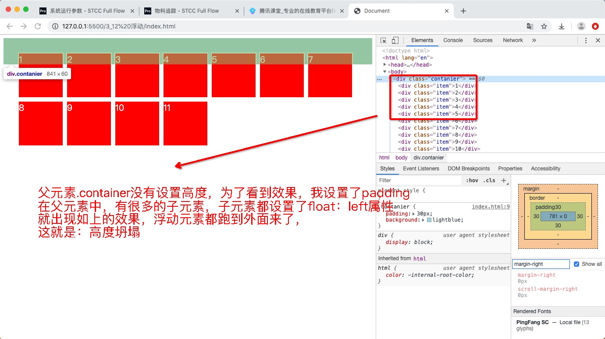
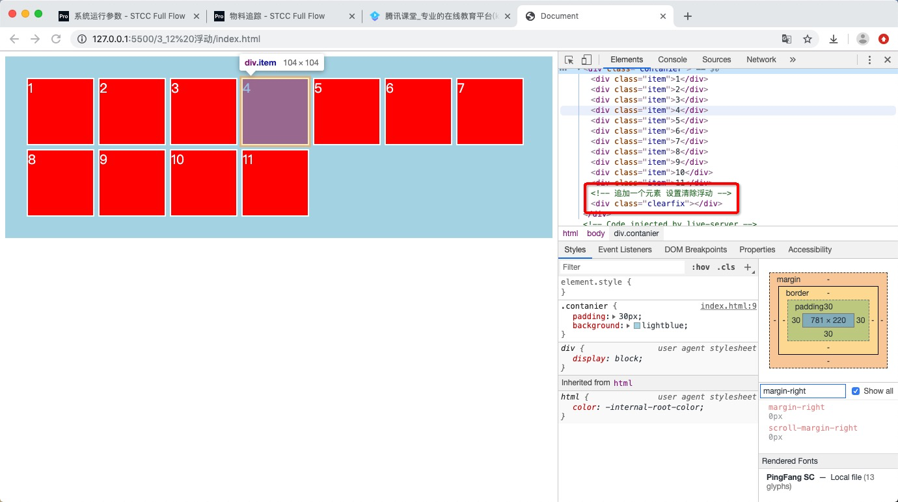
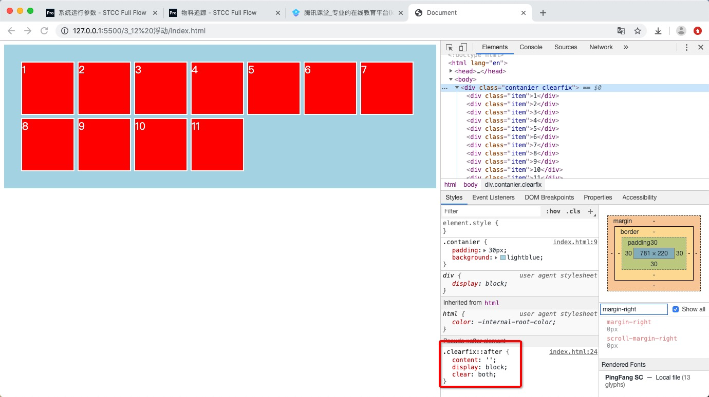

## 前言

视觉格式化模型，大体上将页面盒子的排列分为三种方式：

1. 常规流
2. 浮动
3. 定位


## 浮动的应用场景

1. 文字环绕



2. 横向排列


## 浮动的优势(兼容低版本浏览器)

虽然现在CSS3有很多可以横向排列的方式，比如弹性布局，网格布局，但是一些大型的网站，为了获得更好的兼容性，会使用浮动，因为浮动会兼容低版本的浏览器，IE6，IE7这些等等


## 浮动基本特点

修改float属性为：

- left: 左浮动，元素靠上靠左
- right：右浮动，元素靠上靠右

默认值：none 不浮动（不浮动就是常规流）

### 特点1 当元素浮动后，它就快成了块盒

浮动里面不存在行盒，当一个元素设置了浮动，它就会变成块盒

```html
<!DOCTYPE html>
<html lang="en">
<head>
    <meta charset="UTF-8">
    <meta name="viewport" content="width=device-width, initial-scale=1.0">
    <meta http-equiv="X-UA-Compatible" content="ie=edge">
    <title>Document</title>
    <style>
        span {
            border: 3px solid;
            float: left;
        }
    </style>
</head>
<body>
    <span>
        Lorem ipsum dolor sit.
    </span>
</body>
</html>
```


### 特点2 浮动元素的包含块，和常规流一样，为父元素的内容盒

```html
<!DOCTYPE html>
<html lang="en">
<head>
    <meta charset="UTF-8">
    <meta name="viewport" content="width=device-width, initial-scale=1.0">
    <meta http-equiv="X-UA-Compatible" content="ie=edge">
    <title>Document</title>
    <style>
        .contanier {
            width: 500px;
            height: 500px;
            background: lightblue;
        }
        .contanier div {
            width: 150px;
            height:150px;
            background: red;
        }
        .contanier .left {
            float: left;
        }
        .contanier .right {
            float: right;
        }
    </style>
</head>
<body>
    <div class="contanier">
        <div class="left">Left, ipsum dolor.</div>
        <div class="right">Right, ipsum dolor.</div>
    </div>
</body>
</html>
```



## 浮动盒子的尺寸

### 浮动元素宽度为auto时，它的宽度由内容决定

比如，下面的类选择器left,right的两个子元素，
一个由内容，一个没有内容，我们把它们的宽度值去掉，代码如下

```html
<!DOCTYPE html>
<html lang="en">
<head>
    <meta charset="UTF-8">
    <meta name="viewport" content="width=device-width, initial-scale=1.0">
    <meta http-equiv="X-UA-Compatible" content="ie=edge">
    <title>Document</title>
    <style>
        .contanier {
            width: 500px;
            height: 500px;
            background: lightblue;
        }
        .contanier div {
            /* 去掉子元素的宽度值，width不设置默认为auto */
            /* width: 150px; */
            height:150px;
            background: red;
        }
        .contanier .left {
            float: left;
        }
        .contanier .right {
            float: right;
        }
    </style>
</head>
<body>
    <!-- 子元素设置浮动效果，但是width设置为auto -->
    <div class="contanier">
        <!-- left 无内容 -->
        <div class="left"></div>
        <!-- right 有内容，为：Right, ipsum dolor. -->
        <div class="right">Right, ipsum dolor.</div>
    </div>
</body>
</html>
```


### 浮动元素高度为auto时，它的高度与常规流一样，适应内容的高度

上面的例子，把高度取消测试下即可

### 浮动元素，margin为auto时，为0

与常规流不一样，常规流是会吸收剩余空间

浮动设置了margin，无论从什么方向，设置为auto，都为0

```html
<!DOCTYPE html>
<html lang="en">
<head>
    <meta charset="UTF-8">
    <meta name="viewport" content="width=device-width, initial-scale=1.0">
    <meta http-equiv="X-UA-Compatible" content="ie=edge">
    <title>Document</title>
    <style>
        .contanier {
            width: 500px;
            height: 500px;
            background: lightblue;
        }
        .contanier div {
            background: red;
            /* 设置为auto，页面无变化 */
            margin: auto;
        }
        .contanier .left {
            float: left;
        }
        .contanier .right {
            float: right;
        }
    </style>
</head>
<body>
    <div class="contanier">
        <div class="left">Left, ipsum </div>
        <div class="right">Right, ipsum dolor.</div>
    </div>
</body>
</html>
```



当然设置margin不是auto的情况，是生效的

```css
.contanier div {
    background: red;
    /* 设置为8px, 是生效的 */
    margin: 8px;
}
```


### 边框，内边距，百分比设置，与常规流一样

常规流的宽度百分比设置，看的是所在包含块的宽度的百分比
常规流的高度百分比设置，要看父元素的高度是不是受子元素的影响，如果受影响，则设置高度是无效的，如果不受影响则为内容的高度

## 盒子的排列（位置）

### 总体规则（基本排列）

左浮动的盒子，靠上靠左排列，
右浮动的盒子，靠上靠右排列

如下图，设置的是左浮动，一个挨着一个靠上靠左排列



右浮动



### 规则1 浮动元素的盒子，在包含块内，如果前面右常规流的盒子，会避开常规流盒子

```html
<!DOCTYPE html>
<html lang="en">
<head>
    <meta charset="UTF-8">
    <meta name="viewport" content="width=device-width, initial-scale=1.0">
    <meta http-equiv="X-UA-Compatible" content="ie=edge">
    <title>Document</title>
    <style>
        .contanier {
            width: 800px;
            height: 500px;
            background: lightblue;
        }
        .contanier .item {
            width: 100px;
            height: 100px;
            background: red;
            margin: 3px;
            float: left;
            color: #fff;
            font-size: 20px;
            border: 2px solid;
        }
        .contanier .normal {
            height: 30px;
            background: #008c8c;
        }
    </style>
</head>
<body>
    <div class="contanier">
        <div class="normal"></div>
        <div class="item">1</div>
        <div class="item">2</div>
        <div class="item">3</div>
        <div class="item">4</div>
        <div class="item">5</div>
        <div class="item">6</div>
        <div class="item">7</div>
        <div class="item">8</div>
        <div class="item">9</div>
        <div class="item">10</div>
        <div class="item">11</div>
    </div>
</body>
</html>
```



### 规则2 浮动元素的盒子，在包含块内容，如果后面有常规流的盒子，常规流盒子会无视浮动元素

```html
<!DOCTYPE html>
<html lang="en">
<head>
    <meta charset="UTF-8">
    <meta name="viewport" content="width=device-width, initial-scale=1.0">
    <meta http-equiv="X-UA-Compatible" content="ie=edge">
    <title>Document</title>
    <style>
        .contanier {
            width: 800px;
            height: 500px;
            background: lightblue;
        }
        .contanier .item {
            width: 100px;
            height: 100px;
            background: red;
            margin: 3px;
            float: left;
            color: #fff;
            font-size: 20px;
            border: 2px solid;
        }
        .contanier .normal {
            height: 30px;
            background: #008c8c;
        }
    </style>
</head>
<body>
    <div class="contanier">
        <div class="item">1</div>
        <div class="item">2</div>
        <div class="item">3</div>
        <div class="item">4</div>
        <div class="item">5</div>
        <div class="item">6</div>
        <div class="item">7</div>
        <div class="item">8</div>
        <div class="item">9</div>
        <div class="item">10</div>
        <div class="item">11</div>
        <div class="normal"></div>
    </div>
</body>
</html>
```


**常规流盒子和浮动元素混排的话，情况很多种，这里只是简单的介绍基本的一些区别**

### 行盒在排列时，会避开浮动元素

**如果文字没有在行盒中，浏览器会自动生产一个行盒包裹文字**

```html
<!DOCTYPE html>
<html lang="en">
<head>
    <meta charset="UTF-8">
    <meta name="viewport" content="width=device-width, initial-scale=1.0">
    <meta http-equiv="X-UA-Compatible" content="ie=edge">
    <title>Document</title>
    <style>
        .contanier img {
            float: left;
        }
    </style>
</head>
<body>
    <div class="contanier">
        
        <p>
            Lorem ipsum dolor sit amet consectetur adipisicing elit. Quo suscipit distinctio vero nesciunt reprehenderit? Laboriosam in a dolore corporis sapiente? Omnis dolorum tempora expedita doloremque veritatis harum similique blanditiis distinctio quaerat tenetur dolor delectus nemo, sit fugiat consequuntur ipsa minima quidem labore laborum praesentium magnam vero. Dolores, eligendi id incidunt consectetur odio animi! Deserunt mollitia eligendi inventore adipisci nulla corrupti a cum, porro esse excepturi, ullam modi laudantium unde magni. Nisi eaque velit, iure ex laudantium sequi doloremque eius libero?
        </p>
    </div>
</body>
</html>
```


## 浮动的常见问题：高度塌陷

原因：常规流的盒子的自动高度，在计算时，不会考虑浮动的元素，只考虑常规流盒子下的盒模型

例如：

```html
<!DOCTYPE html>
<html lang="en">
<head>
    <meta charset="UTF-8">
    <meta name="viewport" content="width=device-width, initial-scale=1.0">
    <meta http-equiv="X-UA-Compatible" content="ie=edge">
    <title>Document</title>
    <style>
        .contanier {
            padding: 30px;
            background: lightblue;
        }
        .contanier .item {
            width: 100px;
            height: 100px;
            background: red;
            margin: 3px;
            float: left;
            color: #fff;
            font-size: 20px;
            border: 2px solid;
        }
    </style>
</head>
<body>
    <div class="contanier">
        <div class="item">1</div>
        <div class="item">2</div>
        <div class="item">3</div>
        <div class="item">4</div>
        <div class="item">5</div>
        <div class="item">6</div>
        <div class="item">7</div>
        <div class="item">8</div>
        <div class="item">9</div>
        <div class="item">10</div>
        <div class="item">11</div>
    </div>
</body>
</html>
```



### 解决高度坍塌方法一：clear属性

clear：清除浮动 

- 默认值： none
- left： 清除左浮动，该元素必须出现在前面所有左浮动盒子的下方
- right： 清除右浮动，该元素必须出现在前面所有右浮动盒子的下方
- both： 清除左右浮动，该元素必须出现在前面所有浮动盒子的下方

在浮动元素后追加一个元素，设置clear属性

```html
<!DOCTYPE html>
<html lang="en">
<head>
    <meta charset="UTF-8">
    <meta name="viewport" content="width=device-width, initial-scale=1.0">
    <meta http-equiv="X-UA-Compatible" content="ie=edge">
    <title>Document</title>
    <style>
        .contanier {
            padding: 30px;
            background: lightblue;
        }
        .contanier .item {
            width: 100px;
            height: 100px;
            background: red;
            margin: 3px;
            float: left;
            color: #fff;
            font-size: 20px;
            border: 2px solid;
        }
        .contanier .clearfix {
            /* 设置清除浮动 */
            clear: both;
        }
    </style>
</head>
<body>
    <div class="contanier">
        <div class="item">1</div>
        <div class="item">2</div>
        <div class="item">3</div>
        <div class="item">4</div>
        <div class="item">5</div>
        <div class="item">6</div>
        <div class="item">7</div>
        <div class="item">8</div>
        <div class="item">9</div>
        <div class="item">10</div>
        <div class="item">11</div>
        <!-- 追加一个元素 设置清除浮动 -->
        <div class="clearfix"></div>
    </div>
</body>
</html>
```


### 解决高度坍塌方法二： 伪元素 ::after

方法一的弊端，在于无缘无故的追加了一个没什么用的元素

运用伪元素

```html
<!DOCTYPE html>
<html lang="en">
<head>
    <meta charset="UTF-8">
    <meta name="viewport" content="width=device-width, initial-scale=1.0">
    <meta http-equiv="X-UA-Compatible" content="ie=edge">
    <title>Document</title>
    <style>
        .contanier {
            padding: 30px;
            background: lightblue;
        }
        .contanier .item {
            width: 100px;
            height: 100px;
            background: red;
            margin: 3px;
            float: left;
            color: #fff;
            font-size: 20px;
            border: 2px solid;
        }
        /* 运用伪元素，在微末增加伪元素 */
        .clearfix::after {
            /* 内容为空 */
            content: '';
            /* 设置为块盒 */
            display: block;
            /* 清除浮动 */
            clear: both;
        }
    </style>
</head>
<body>
    <div class="contanier clearfix">
        <div class="item">1</div>
        <div class="item">2</div>
        <div class="item">3</div>
        <div class="item">4</div>
        <div class="item">5</div>
        <div class="item">6</div>
        <div class="item">7</div>
        <div class="item">8</div>
        <div class="item">9</div>
        <div class="item">10</div>
        <div class="item">11</div>
    </div>
</body>
</html>
```



