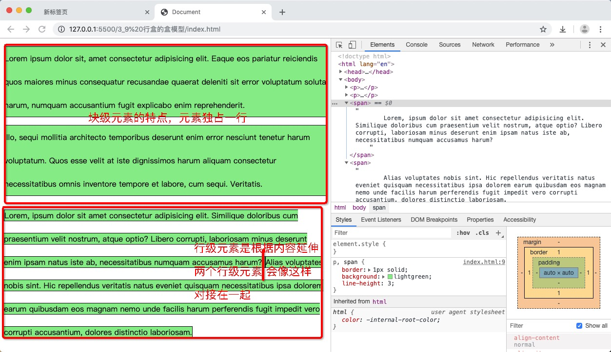
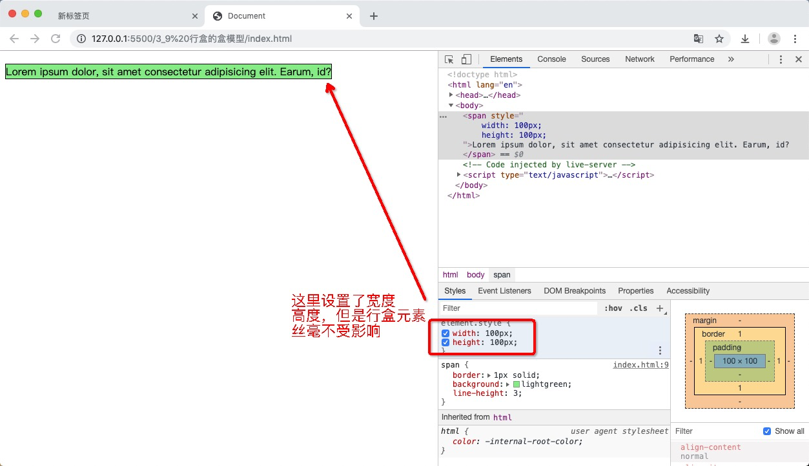
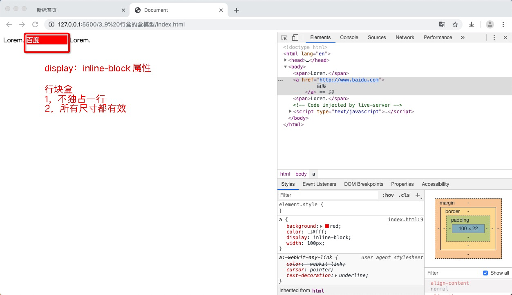
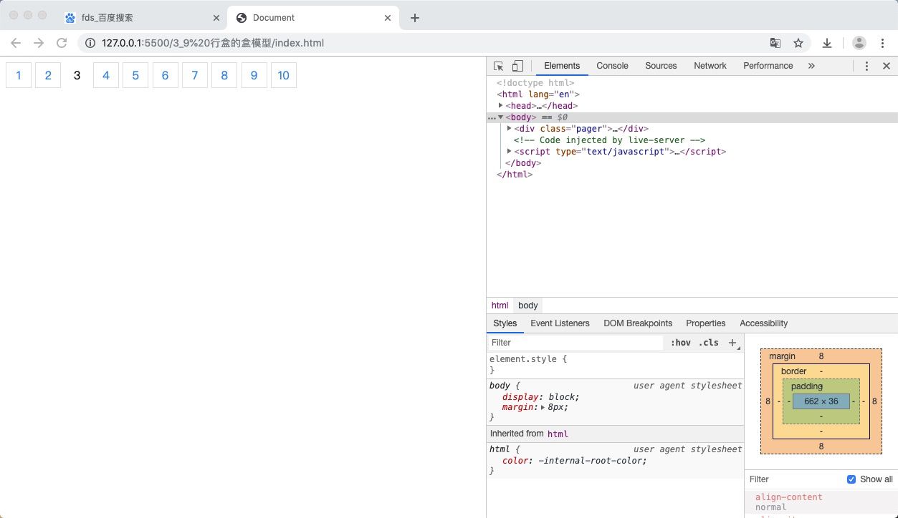
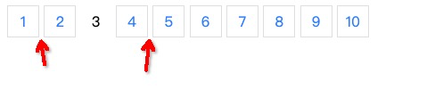
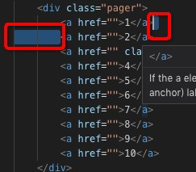
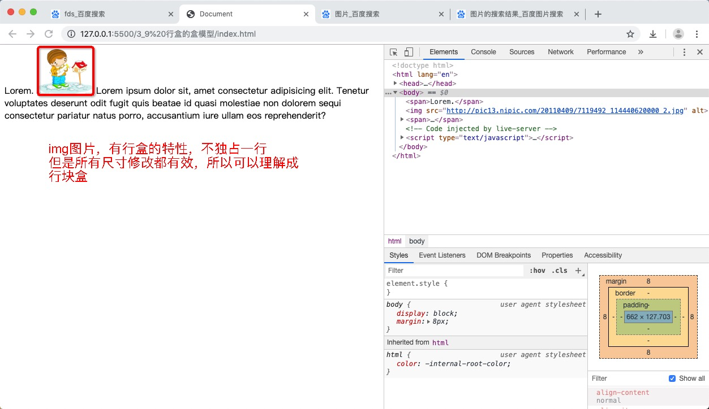
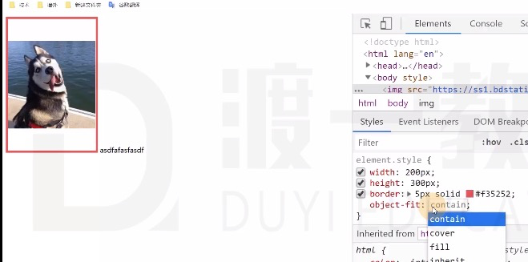
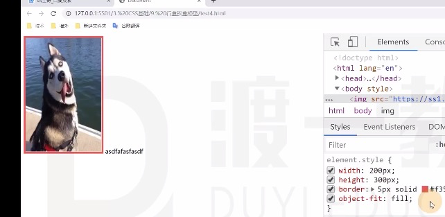
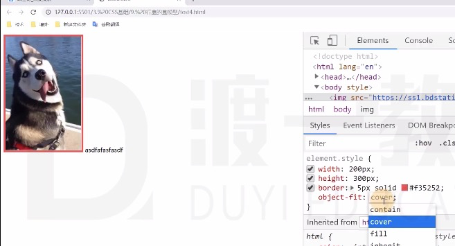

## 概念

常见的行盒：包含具体的内容的元素

span, strong, em, i, img ...

## 特点

### 1. 行盒是跟着内容延伸的



### 2. 行盒是不能设置宽度，高度的，设置不生效的

因为行盒是根据内容延伸的，所以就是内容有多长多高，它就有多长多高



**如何调整行盒的宽度，高度呢？**

通过设置字体的大小，行高，字体类型，简介调整


### 填充区（padding）

- 水平方向上有效
- 垂直方向只会影响背景，不会实际占用空间(因为浏览器认为，文字的高度取决于行高)

### 边框 （border)

- 水平方向上有效
- 垂直方向只会影响背景，不会实际占用空间

### 外边距 （margin)

- 水平方向上有效
- 垂直方向上无效

## 行块盒

display: inline-block 的盒子

既有行盒的特点，也有块盒的特点

- 不独占一行
- 盒模型中，所有尺寸都有效（padding，maring, padding， width, height）

```html
<!DOCTYPE html>
<html lang="en">
<head>
    <meta charset="UTF-8">
    <meta name="viewport" content="width=device-width, initial-scale=1.0">
    <meta http-equiv="X-UA-Compatible" content="ie=edge">
    <title>Document</title>
    <style>
        a{
            background: red;
            color: #fff;
            display: inline-block;
            width: 100px;
        }
    </style>
</head>
<body>
    <span>Lorem.</span>
    <a href="http://www.baidu.com">
        百度
    </a>
    <span>Lorem.</span>
</body>
</html>
```


### 实际应用

一般用于分页的显示


实操练习，分页
```html
<!DOCTYPE html>
<html lang="en">
<head>
    <meta charset="UTF-8">
    <meta name="viewport" content="width=device-width, initial-scale=1.0">
    <meta http-equiv="X-UA-Compatible" content="ie=edge">
    <title>Document</title>
    <style>
        .pager a{
            border: 1px solid #e1e2e3;
            text-decoration: none;
            color: #38f;
            /*通过行块盒 设置宽高*/
            display: inline-block;
            width: 34px;
            height: 34px;
            text-align: center;
            line-height: 34px;
        }
        .pager a:hover{
            border-color: #38f;
            background: #f2f8ff;
        }
        .pager .selected{
            color: #000;
            border: none;
            background: initial;
        }
    </style>
</head>
<body>
    <div class="pager">
        <a href="">1</a>
        <a href="">2</a>
        <a href="" class="selected">3</a>
        <a href="">4</a>
        <a href="">5</a>
        <a href="">6</a>
        <a href="">7</a>
        <a href="">8</a>
        <a href="">9</a>
        <a href="">10</a>
    </div>
</body>
</html>
```
效果如下



虽然实际的效果出来了，但是发现有一个小问题
就是当我鼠标移动上面时，背景颜色出来了


怎么解决这个问题呢，这就用到了我们之前所学的知识，层叠的知识

我们先来看一下 所在的选择器中 背景颜色的权重高低
```html
<a href="" class="selected">3</a>
```
层叠性高低如下
```css
/*背景颜色background有声明冲突 因为都是作者样式 所以我们比较特殊性*/
 .pager a:hover{
    border-color: #38f;
    /*特殊性对应的四位数 0 0 2 1 (1个类选择器，1个伪类选择器，一个元素选择器)*/
    background: #f2f8ff;
}
.pager .selected{
    color: #000;
    border: none;
    /*特殊性对于的四位数 0 0 2 0 （2个类选择器）*/
    background: initial;
}
```
上述可得结论 .pager a:hover的背景声明的权重等级是高的，所以鼠标移到上面，会显示该选择器下的背景色

如何处理呢？
需要增加 .pager .selected 选择器的权重等级,改成如下：
```css
/*背景颜色background有声明冲突 因为都是作者样式 所以我们比较特殊性*/
 .pager a:hover{
    border-color: #38f;
    /*特殊性对应的四位数 0 0 2 1 (1个类选择器，1个伪类选择器，一个元素选择器)*/
    background: #f2f8ff;
}
/*增加元素选择器a, 权重等级就与上面的一样，再依据源次序的规则，靠后的生效，完美解决*/
.pager a.selected{
    color: #000;
    border: none;
    /*特殊性对于的四位数 0 0 2 0 （2个类选择器）*/
    background: initial;
}
```
```html
<!DOCTYPE html>
<html lang="en">
<head>
    <meta charset="UTF-8">
    <meta name="viewport" content="width=device-width, initial-scale=1.0">
    <meta http-equiv="X-UA-Compatible" content="ie=edge">
    <title>Document</title>
    <style>
        .pager a{
            border: 1px solid #e1e2e3;
            text-decoration: none;
            color: #38f;
            /*通过行块盒 设置宽高*/
            display: inline-block;
            width: 34px;
            height: 34px;
            text-align: center;
            line-height: 34px;
        }
        .pager a:hover{
            border-color: #38f;
            background: #f2f8ff;
        }
        /*这里发生变化，选择器等级提升*/
        .pager a.selected{
            color: #000;
            border: none;
            background: initial;
        }
    </style>
</head>
<body>
    <div class="pager">
        <a href="">1</a>
        <a href="">2</a>
        <a href="" class="selected">3</a>
        <a href="">4</a>
        <a href="">5</a>
        <a href="">6</a>
        <a href="">7</a>
        <a href="">8</a>
        <a href="">9</a>
        <a href="">10</a>
    </div>
</body>
</html>
```

### 缺点：有空白折叠的情况发生



还是上面的实操练习图，效果出来，发现会有空白折叠的情况

这是因为：下图的空白区域，出现了空白折叠，有一个空格的原因


## 扩展知识：可替换元素 非可替换元素

### 非可替换元素

大部分元素，页面上显示的结果，取决于元素内容，叫**非可替换元素**
（p元素，div元素... 里面写了什么，就显示什么）

### 可替换元素

少部分元素，页面上显示的结果，取决于元素的属性，成为**可替换元素**
（img, audio, video）
比如：img元素显示的内容，取决于src属性
```html

```

- 大部分可替换元素，都是行盒元素
- 特殊情况，可替换元素类似于行块盒，盒模型中所有尺寸修改都有效


### 图片的属性扩展： object-fit

- contain 图片宽高比例不变



- fill (默认取值)



- cover (铺满，所有有些内容会丢失)

